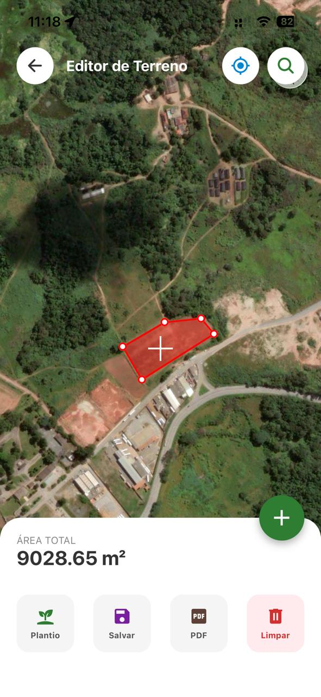
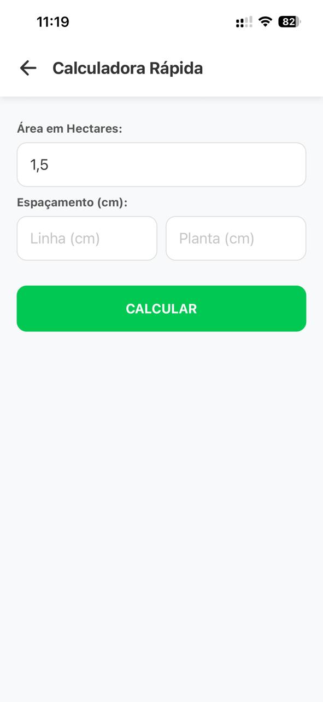
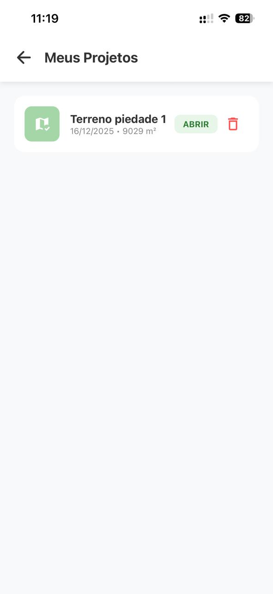

(feito com Vibe coding)

# 🚜 AgroSketch Pro

> Uma ferramenta móvel robusta para mapeamento rural, medição de áreas via satélite e planejamento de plantio.

## 📱 Sobre o Projeto

O **AgroSketch Pro** foi desenvolvido para resolver dores reais de engenheiros agrônomos e produtores rurais. Ele substitui anotações em papel e medições manuais imprecisas por uma interface digital baseada em geolocalização.

O aplicativo permite desenhar talhões (áreas de plantio) sobre imagens de satélite, calcular automaticamente a área em hectares ou metros quadrados e estimar a quantidade de insumos/mudas necessárias com base no espaçamento de plantio.

## ✨ Funcionalidades Principais

* **🛰️ Mapeamento via Satélite:** Desenho de polígonos precisos usando a API do Google Maps.
* **📏 Cálculos Automáticos:** * Área Total (Hectares e m²).
    * Perímetro.
* **🌱 Calculadora Agrícola:** Estimativa de estande (quantidade de plantas) e metros lineares baseada no espaçamento (Linha x Planta).
* **💾 Gestão de Projetos:** Salve, edite e exclua mapeamentos localmente (Persistência de dados offline).
* **📄 Relatórios em PDF:** Geração automática de relatórios com "foto" do mapa e tabela de dados prontos para compartilhamento (WhatsApp/E-mail).
* **📍 GPS Tracking:** Localização em tempo real do usuário no campo.

## 📸 Screenshots

| Editor de Terreno | Calculadora de Plantio | Meus Projetos |
|:---:|:---:|:---:|
|  |  |  |

## 🛠️ Tecnologias Utilizadas

* **Core:** React Native (Expo SDK 50+)
* **Linguagem:** TypeScript
* **Mapas:** `react-native-maps` (Google Maps API)
* **Geometria:** `@turf/turf` (Cálculos geoespaciais avançados)
* **Persistência:** `AsyncStorage`
* **Exportação:** `expo-print` & `expo-sharing` (PDF) & `react-native-view-shot`

